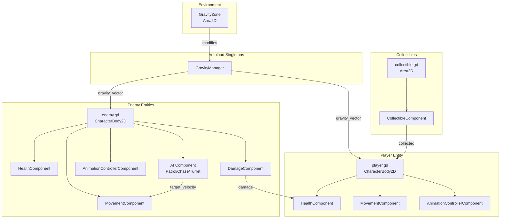

# Antigravity - System Architecture

## Overview

Antigravity is a 2D platformer built in Godot 4.5 featuring a **component-based architecture** with modular, reusable systems. The architecture emphasizes separation of concerns, testability, and extensibility.

## Architecture Principles

### 1. **Component-Based Design**
- Entities are composed of small, focused components
- Each component handles a single responsibility
- Components communicate via signals (event-driven)
- Easy to mix and match for different entity types

### 2. **Singleton Pattern (Autoload)**
- Global managers handle cross-cutting concerns
- Currently: `GravityManager` for physics
- Accessible from any script via autoload

### 3. **Signal-Driven Communication**
- Loose coupling between systems
- Components emit signals for state changes
- Parent entities or other systems can subscribe
- Prevents tight dependencies

## System Architecture Diagram



## Directory Structure

```
antigravity/
├── scripts/
│   ├── autoload/          # Global singletons
│   │   └── gravity_manager.gd
│   ├── components/        # Reusable components
│   │   ├── health_component.gd
│   │   ├── movement_component.gd
│   │   ├── damage_component.gd
│   │   ├── collectible_component.gd
│   │   ├── animation_controller_component.gd
│   │   └── ai/
│   │       ├── patrol_ai.gd
│   │       ├── chase_ai.gd
│   │       └── turret_ai.gd
│   ├── player/            # Player-specific logic
│   │   └── player.gd
│   ├── enemies/           # Enemy-specific logic
│   │   ├── flyer_drone.gd
│   │   ├── turret.gd
│   │   └── antigrav_orb.gd
│   ├── gravity/           # Gravity system
│   │   └── gravity_zone.gd
│   ├── projectiles/       # Projectile behavior
│   ├── collectibles/      # Collectible behavior
│   ├── level/             # Level-specific scripts
│   └── ui/                # UI components
├── scenes/                # Scene files (.tscn)
├── assets/                # Sprites, audio, etc.
├── resources/             # Animation data, configs
├── tests/                 # GUT unit tests
└── docs/                  # Documentation
```

## Core Systems

### 1. Gravity System

**Architecture**: Singleton + Zone-based modifiers

**Components**:
- `GravityManager` (Autoload): Global gravity state
- `GravityZone` (Area2D): Local gravity modifiers
- Player/Enemy scripts: Apply gravity to physics

**Flow**:
1. `GravityManager` maintains current gravity direction and strength
2. Entities query `GravityManager.get_gravity_vector()` each frame
3. `GravityZone` areas can temporarily modify gravity
4. Player can flip gravity (when ability unlocked)

**Key Features**:
- Directional gravity (any Vector2)
- Strength modulation (0.0 to 5.0x)
- Cardinal direction helpers (up/down/left/right)
- Signal-based notifications

### 2. Component System

**Core Components**:

#### HealthComponent
- **Purpose**: Health, damage, death, invincibility
- **Signals**: `health_changed`, `died`, `damaged`, `healed`
- **Key Methods**: `take_damage()`, `heal()`, `set_invincible()`

#### MovementComponent
- **Purpose**: Physics-based movement
- **Signals**: `velocity_changed`
- **Key Methods**: `set_target_direction()`, `apply_impulse()`, `update()`

#### DamageComponent
- **Purpose**: Deal damage on collision
- **Signals**: `hit_target`, `hit_blocked`
- **Key Methods**: Auto-detects collisions, applies knockback

#### CollectibleComponent
- **Purpose**: Pickup behavior
- **Signals**: `collected`, `collection_failed`
- **Key Methods**: `collect()`, auto-detection

#### AnimationControllerComponent
- **Purpose**: Animation state management
- **Signals**: `animation_changed`
- **Key Methods**: `play()`, `play_if_not()`, `set_sprite_direction()`

**AI Components**:

#### PatrolAI
- **Purpose**: Waypoint-based patrol
- **Signals**: `reached_waypoint`, `patrol_direction_changed`
- **Key Methods**: `get_target_velocity()`, waypoint management

#### ChaseAI
- **Purpose**: Target pursuit with line-of-sight
- **Signals**: `target_acquired`, `target_lost`, `target_in_range`
- **Key Methods**: `get_target_velocity()`, `has_target()`

#### TurretAI
- **Purpose**: Stationary aiming and firing
- **Signals**: `target_acquired`, `ready_to_fire`, `fired`
- **Key Methods**: Auto-fires at targets, rotation tracking

### 3. Entity Composition

**Player Entity**:
```
Player (CharacterBody2D)
├── player.gd (input handling, gravity integration)
├── HealthComponent
├── MovementComponent
└── AnimationControllerComponent
```

**Enemy Entity (Flyer Drone)**:
```
FlyerDrone (CharacterBody2D)
├── flyer_drone.gd (entity controller)
├── HealthComponent
├── MovementComponent
├── DamageComponent
├── AnimationControllerComponent
└── ChaseAI
```

**Enemy Entity (Turret)**:
```
Turret (CharacterBody2D)
├── turret.gd (entity controller)
├── HealthComponent
├── DamageComponent
├── AnimationControllerComponent
└── TurretAI
```

### 4. Signal Flow Example

**Player Takes Damage**:
```
1. Enemy DamageComponent detects collision with Player
2. DamageComponent calls Player.HealthComponent.take_damage()
3. HealthComponent emits 'damaged' signal
4. Player controller receives signal, triggers invincibility
5. HealthComponent emits 'health_changed' signal
6. UI (future) updates health bar
7. If health <= 0, HealthComponent emits 'died' signal
8. Player controller handles death animation/respawn
```

## Data Flow

### Physics Update Loop
```
1. _physics_process(delta) called on all entities
2. Player/Enemy queries GravityManager.get_gravity_vector()
3. Apply gravity to velocity
4. MovementComponent.update(delta) calculates movement
5. AI Components provide target velocity
6. Entity calls move_and_slide()
7. Collision detection triggers DamageComponent
8. AnimationControllerComponent updates based on state
```

### Input Flow (Player)
```
1. User presses key (e.g., "move_right")
2. player.gd receives input in _physics_process()
3. Sets MovementComponent.set_target_direction(Vector2.RIGHT)
4. MovementComponent calculates acceleration
5. Player applies velocity with move_and_slide()
6. AnimationControllerComponent.play("walk")
```

## Testing Architecture

**Framework**: GUT (Godot Unit Test)

**Test Coverage**:
- 75+ unit tests
- ~85% code coverage for core components
- CI/CD via GitHub Actions

**Test Structure**:
```
tests/
├── unit/
│   ├── components/
│   │   ├── test_health_component.gd
│   │   ├── test_movement_component.gd
│   │   ├── test_damage_component.gd
│   │   └── test_collectible_component.gd
│   └── autoload/
│       └── test_gravity_manager.gd
└── integration/
    └── (future integration tests)
```

**Testing Approach**:
- Each component tested in isolation
- Mock dependencies where needed
- Signal emission verification
- Edge case coverage

## Scalability & Extensibility

### Adding New Enemy Types
1. Create new scene with CharacterBody2D
2. Add desired components (Health, Movement, Damage, Animation)
3. Add AI component (Patrol, Chase, or Turret)
4. Create entity-specific script for unique behavior
5. No changes to core components needed

### Adding New Abilities
1. Create new component (e.g., `DashComponent`)
2. Add to player scene
3. Connect signals to player controller
4. Update input handling in `player.gd`
5. Add tests for new component

### Adding New Mechanics
1. Create new autoload singleton if global state needed
2. Or create new component if entity-specific
3. Use signals for communication
4. Maintain separation of concerns

## Performance Considerations

- **Component Overhead**: Minimal, components are lightweight nodes
- **Signal Performance**: Godot signals are optimized, negligible overhead
- **Gravity Queries**: Single function call per entity per frame
- **AI Updates**: Only active when targets in range
- **Animation**: State-based, only updates on state change

## Future Architecture Plans

### Phase 2: Resource System
- `ResourceComponent` for collectibles
- `InventoryComponent` for player
- Resource manager singleton

### Phase 3: Ability System
- `AbilityComponent` base class
- Specific abilities (Dash, Shield, etc.)
- Cooldown management
- Unlock progression

### Phase 4: UI System
- HUD manager singleton
- Health bar component
- Resource display component
- Menu system

### Phase 5: Audio System
- Audio manager singleton
- Sound effect component
- Music manager
- Dynamic audio zones

## Best Practices

1. **Keep Components Focused**: One responsibility per component
2. **Use Signals**: Avoid direct dependencies between components
3. **Export Key Values**: Make components configurable in editor
4. **Test Components**: Write unit tests for all components
5. **Document Signals**: Clearly document all emitted signals
6. **Avoid Singletons**: Only use for truly global state
7. **Composition Over Inheritance**: Prefer components over deep class hierarchies

## References

- [Component Guide](file:///d:/GameDevelopment/Godot/Games/antigravity/scripts/components/COMPONENT_GUIDE.md)
- [Quick Reference](file:///d:/GameDevelopment/Godot/Games/antigravity/scripts/QUICK_REFERENCE.md)
- [Testing Guide](file:///d:/GameDevelopment/Godot/Games/antigravity/docs/TESTING_GUIDE.md)
- [GDD](file:///d:/GameDevelopment/Godot/Games/antigravity/docs/GDD_UPDATED_2026-01-07.md)
